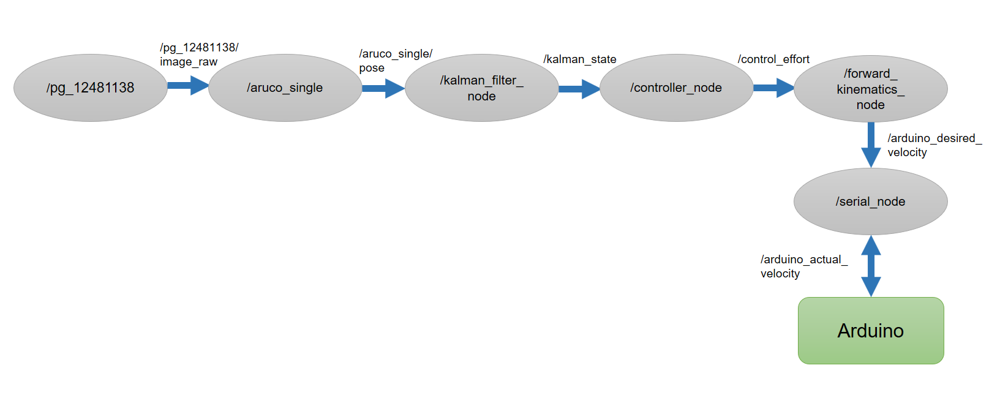
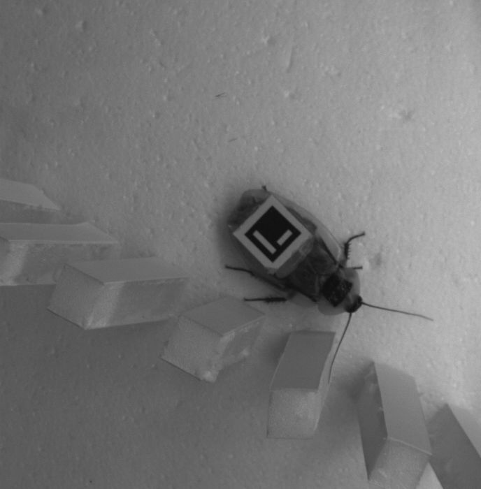
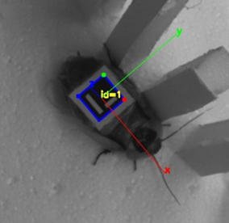
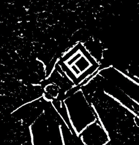
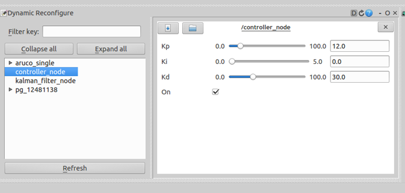
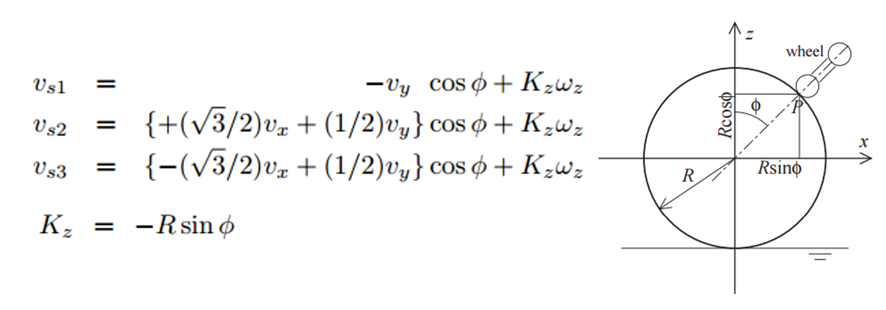

# Nodes



### Table of Contents
* [Overview and Setup](https://github.com/TerradynamicsLab/terrain_treadmill#terrain-treadmill)
* [Nodes](#nodes)
	* [/pg_12481138](#pg_12481138)
	* [aruco_single](#aruco_single)
	* [kalman_filter_node](#kalman_filter_node)
		* [tag_marker](#tag_marker)
		* [filter_marker](#filter_marker)
		* [tuning](#tuning)
	* [controller_node](#controller_node)
	* [forward_kinematics_node](#forward_kinematics_node)
	* [serial_node](#serial_node)
	* [motor_test_node](#motor_test_node)
* [Launch Files](../launch#launch-files)
* [Arduino Code](../Arduino#arduino-code)

## pg_12481138
This node publishes data from the camera used to track the Aruco tag located on the animal. It is started by [flea3.launch](../launch/flea3.launch). This node publishes several topics, the most relevant topics are:
* `/pg_12481138/camera_info` contains camera calibration data. It is used by the `aruco_single` node to convert tag position from pixels into real-world coordinates.
* `/pg_12481138/image_raw` contains the raw images output by the camera.
* `/pg_12481138/image_raw/compressed` contains compressed images output by the camera. Recording compressed images rather than raw images using rosbag results in smaller file sizes. Generally, all image topics in this package contain a corresponding compressed version. To view this topic using image_view, use: `rosrun image_view image_view image:=/pg_12481138/image_raw compressed`.



## aruco_single
This node performs Aruco tag tracking. It is started by [aruco_marker_finder.launch](../launch/aruco_marker_finder.launch) It subscribes to `/pg_12481138/image_raw` and `/pg_12481138/camera_info` and uses this data to detect the tag position and convert it to real-world coordinates. This node publishes several useful topics:
* `/aruco_single/pose` contains position and orientation of Aruco tag using [geometry_msgs/Pose](http://docs.ros.org/api/geometry_msgs/html/msg/Pose.html) message.
* `/aruco_single/result` contains image displaying tag tracking result. Useful for tuning tracking and camera parameters.



* `/aruco_single/debug` contains binary image displaying result of image thresholding performed Aruco node. This image is used to tune the Aruco parameters discussed [here](https://github.com/BlakeStrebel/terrain_treadmill#device-tuning).



## kalman_filter_node
[kalman_filter_node.py](./kalman_filter_node.py) filters noisy position data from Aruco tag tracking. Furthermore, this node is used to predict tag location when the tag is temporarily obscured by obstacles. This makes the apparatus more reliable and less-prone to sudden impulses when tracking is inconsistent. This node is a constant velocity Kalman filter. To learn more about Kalman filters, start [here](https://en.wikipedia.org/wiki/Kalman_filter).

The node subscribes to the `aruco_single/pose` topic, performs filtering, and publishes the `kalman_state` topic at a [fixed frequency](./kalman_filter_node.py#L48) regardless of camera frame-rate. The filter first predicts a new state using previous state information and a constant velocity kinematic model.

```python

# Time Update (Prediction)
# ========================
# Project the state ahead
self.x = self.F*self.x

# Project the error covariance ahead
self.P = self.F*self.P*self.F.T + self.Q								

```

 Then, if new state information has been determined by the Aruco tracking node, it performs a correction (measurement) in which it uses measurement information to obtain a more accurate guess of the tag state as well as to influence future predictions.

```python
# Measurement Update (Correction)
# ===============================
# Compute the Kalman Gain
S = self.H*self.P*self.H.T + self.R
K = (self.P*self.H.T) * np.linalg.pinv(S)

# Update the estimate via z
Z = np.matrix([[self.posex, self.posey, self.yaw]]).T
y = Z - (self.H*self.x)
self.x = self.x + (K*y)

# Update the error covariance
self.P = (self.I - (K*self.H)) *self.P

 ```

 If no measurement information is available, it continues performing predictions until a limit is reached. After this limit, it uses measurements of zero to halt the apparatus motion until Aruco tracking information becomes available.

 ```python

 if self.missed_frames > 15:
 				##  Use zero as the measurement
 				self.posex = 0
 				self.posey = 0
 				self.yaw = 0

 				# Compute the Kalman Gain
 				S = self.H*self.P*self.H.T + self.R
 				K = (self.P*self.H.T) * np.linalg.pinv(S)

 				# Update the estimate via z
 				Z = np.matrix([[self.posex, self.posey, self.yaw]]).T
 				y = Z - (self.H*self.x)
 				self.x = self.x + (K*y)

 				# Update the error covariance
 				self.P = (self.I - (K*self.H)) *self.P

 ```

 The filter's process covariance can be tuned using rqt_reconfigure to alter the sensitivity to new measurements. The tag_marker and filter_marker nodes discussed below can be helpful in tuning the filter parameters to obtain the desired response.

 #### tag_marker

 [tag_marker.py](./tag_marker.py) subscribes to Aruco tag information from the `/aruco_single/pose` topic. It uses this data to publish an [Rviz](http://wiki.ros.org/rviz) marker on the `/tag_marker` topic.

 #### filter_marker

 [filter_marker.py](./filter_marker.py) subscribes to filter information on the `/kalman_state` topic. It uses this data to publish an Rviz marker on the `/filter_marker topic`

 #### tuning
[Rviz](http://wiki.ros.org/rviz) is a ROS package useful for data visualization. It subscribes to [Rviz Markers](http://wiki.ros.org/rviz/DisplayTypes/Marker) and displays them in a 3-D environment. These markers can be used to tune the Kalman filter process covariance (or other parameters) using rqt_reconfigure. To start the apparatus in the proper configuration for tuning, set the Rviz argument to true: `roslaunch terrain_treadmill start.launch Rviz:=true`.

[Examples]


## controller_node

[controller_node.py](./controller_node.py) is the high level position PID controller for the device. This node subscribes to the `/kalman_state` topic containing position information about the tag located on the animal body. The 2-D deviation from center (x,y) is used as the error for the controller. The orientation (theta) is not considered. The error is fed into a PID controller and control effort is calculated:

```python
def PID_Controller(self, msg):
    # Calculate Error
    self.Ex = msg.x
    self.Ey = msg.y
    # self.Et = msg.theta

    # Calculate Integral Error
    self.Exint = self.Exint + self.Ex
    self.Eyint = self.Eyint + self.Ey
    # self.Etint = self.Etint + self.Et

    # Calculate Derivative Error
    self.Exdot = self.Ex - self.Exold
    self.Eydot = self.Ey - self.Eyold
    # self.Etdot = self.Et - self.Etold

    # Update Previous Error
    self.Exold = self.Ex
    self.Eyold = self.Ey
    # self.Etold = self.Et

    # Calculate Control Effort
    self.controlEffort.Ux = self.Kp*self.Ex + self.Ki*self.Exint + self.Kd*self.Exdot
    self.controlEffort.Uy = self.Kp*self.Ey + self.Ki*self.Eyint + self.Kd*self.Eydot
    self.controlEffort.Ut = 0.0 #self.Kp*self.Et + self.Ki*self.Etint + self.Kd*self.Etdot
    self.controlEffort.header.stamp = rospy.Time.now()
```

 This control effort is published on the `/control_effort` topic. When the tag is within 3 mm of the center of the frame, no control effort is used. The PID gains are tunable using rqt_reconfigure. The controller can also be turned on/off using rqt_reconfigure.



## forward_kinematics_node

[forward_kinematics_node.py](./forward_kinematics_node.py) subscribes to the `/control_effort` containing real-world control effort information (x, y, theta) and converts this information into the required motor velocities for the three motors which will cause the ball to rotate in the desired trajectory. These velocities are then converted from `rad/s` into `encoder counts/controller interrupt` and published on the `/arduino/desired_velocity_counts` topic.

The forward kinematics for this structure were obtained from this [paper](http://ieeexplore.ieee.org/document/5152324/). They are given by:



## serial_node

The serial node is started by [serial.launch](../launch/serial.launch). This node is responsible for maintaining communication between ROS and the Arduino. It subscribes to the `/arduino/desired_velocity_counts` topic and sends this data to the Arduino over the computer's serial port. It also receives the `/arduino/actual_velocity_counts` information over the same serial port and publishes this topic.

## motor_test_node

[motor_test_node.py](./motor_test_node.py) can be used to tune the PID controllers being used to control the DC motors. The node uses rqt_reconfigure to send desired velocities to each motor in counts. The desired/actual velocities can be plotted to aid in the tuning of the controllers.
* `rosrun terrain_treadmill motor_test_node.py` to start the node
* `rosrun rqt_reconfigure rqt_reconfigure` to startup rqt_reconfigure
* `rosrun rqt_plot rqt_plot` to start rqt_plot. Add `/arduino/actual_velocity_counts` and `/arduino/desired_velocity_counts` and then configure to visualize results
